### README

# 가지마켓

   
  
   

## 프로젝트 소개

편리하게 중고거래를 중고상품 거래 및 소통을 위한 플랫폼으로서, 사용자들이 편리하고 간단하게 거래하고 소통할 수 있는 환경을 제공한다. 다양한 상품 카테고리로 사용자들이 다양한 상품을 구매하고 판매하는데, 자유게시판을 통하여 사용자들 간의 소통을 촉진하여, 커뮤니티를 형성하고 함께 발전시켜 나가는 것 목표이다.

<strong>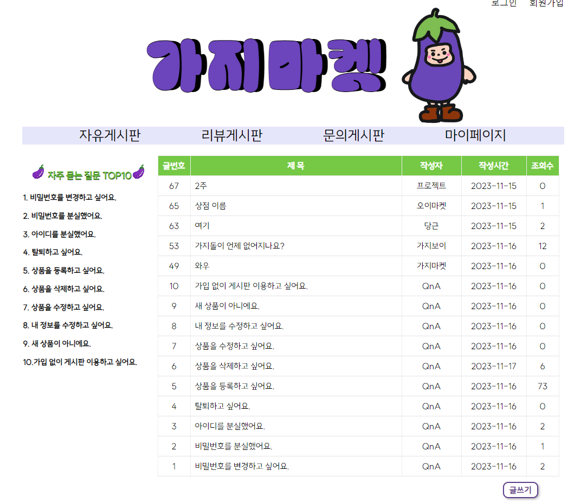
<strong>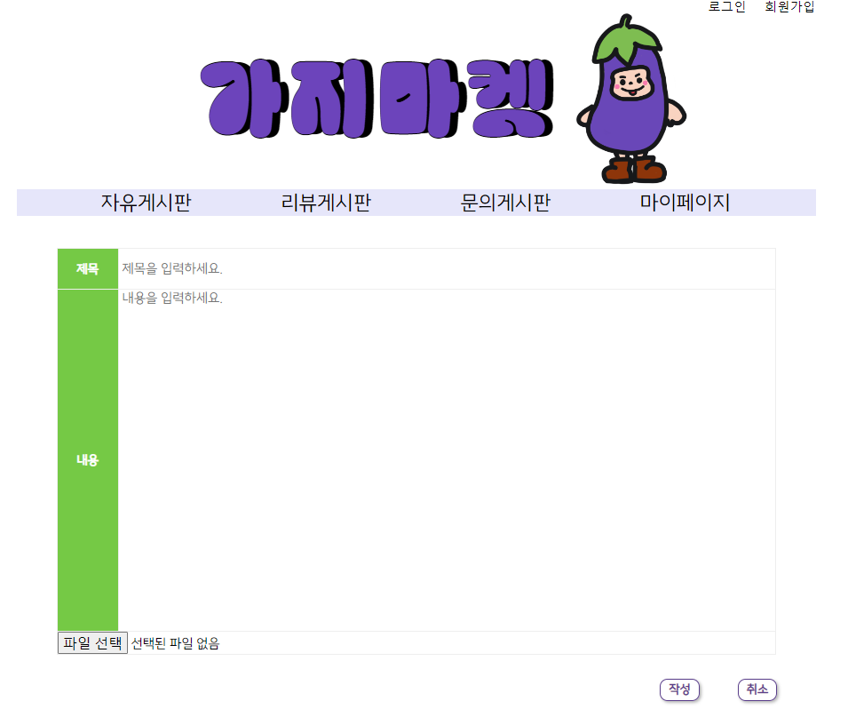
<strong>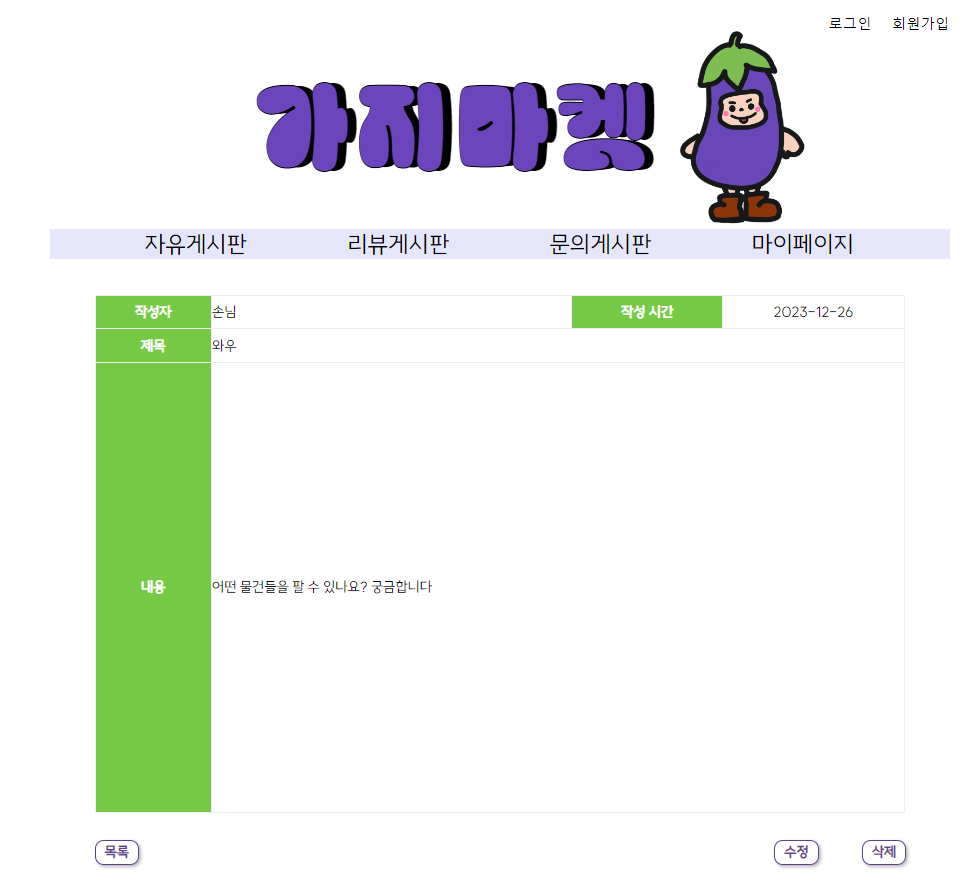
<strong>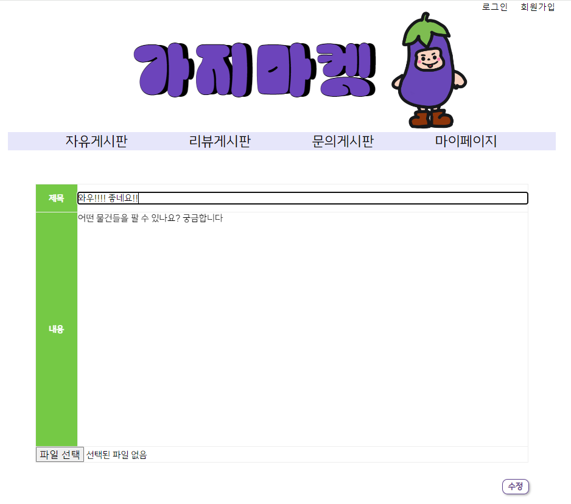
<strong>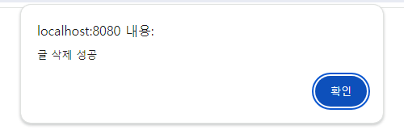

 

## 기술 스택

| JavaScript |  Java   |
| :--------: | :-----: |
|   ![js]    | ![java] |

 

## 구현 기능

### 기능 1

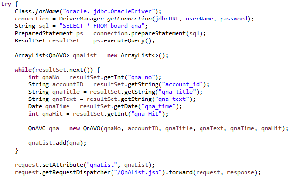 
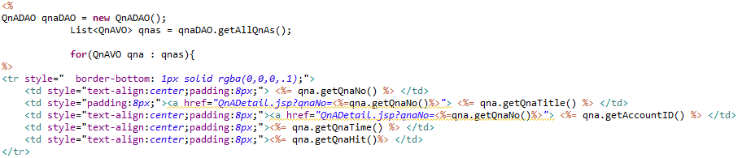 

### 기능 2

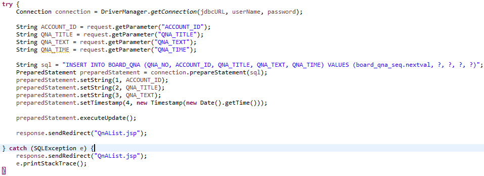 

### 기능 3

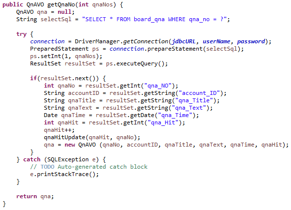 
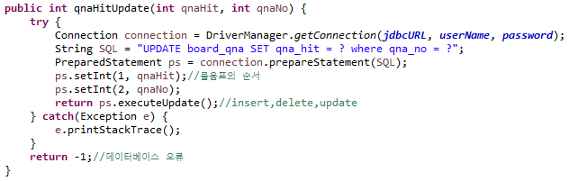 

### 기능 4

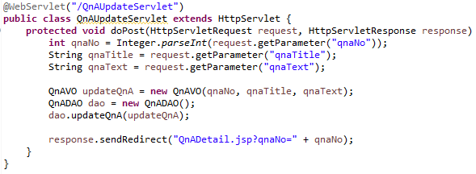 
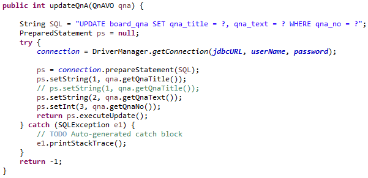 

### 기능 5

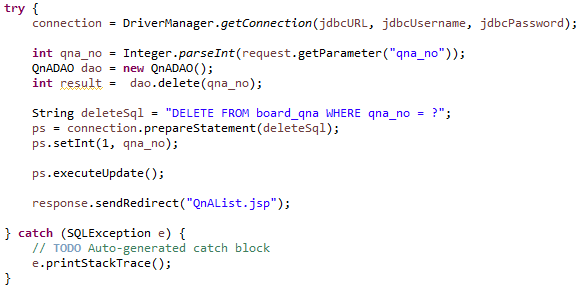 
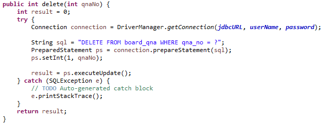 

## 배운 점 & 아쉬운 점

배운 점
데이터베이스와 코드의 연결, 작동 원리

아쉬운 점 12/13 해결해야할 점
중복된 코드 재사용성으로 변경해서 코드 정렬.

 

<!-- Stack Icon Refernces -->

[js]: ./readme-static/img/javascript.svg
[java]: ./readme-static/img/java.svg
